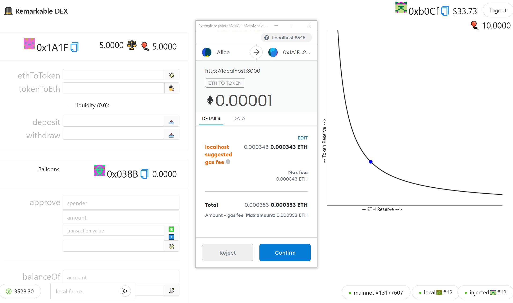

# A SIMPLE DEX 🤝

This project is still buggy and require more work for a better UX

### Dependencies 

- [NodeJS>=10](https://nodejs.org/en/download/) 
- [Yarn](https://classic.yarnpkg.com/en/docs/install/) 
- [Git](https://git-scm.com/downloads)

### Quickstart

Clone or fork the repo and install it

```bash
yarn install
```

Edit your frontend at `App.js` under `packages/react-app/src`

Compile the contracts

```bash
yarn run compile
```

Run each of the following in new terminals

```bash
yarn run chain

yarn start

yarn run deploy
```

The frontend will be deployed at [local host](http://localhost:3000)


